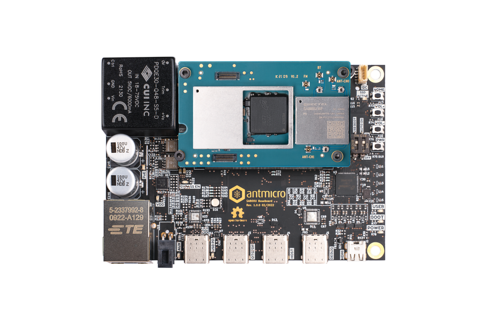

# Antmicro's open source SA800U (Snapdragon 845) Baseboard

Copyright (c) 2022 [Antmicro](https://www.antmicro.com)

## Overview

This repository contains open hardware design files for an experimental development board for Quectel [SA800-U](https://www.quectel.com/product/sa800u-wf-smart-module) System on Module (SoM) featuring Qualcomm [Snapdragon 845 Mobile Platform](https://www.qualcomm.com/products/application/smartphones/snapdragon-8-series-mobile-platforms/snapdragon-845-mobile-platform).
This development board break-routes the relevant I/O interfaces from the SoM keeping a small mechanical outline. 
The design files were prepared in KiCad.

## Repository structure

The main repository directory contains KiCad PCB project files, a LICENSE and README.
The remaining files are stored in the following directories:

* `lib` - contains the component libraries
* `img` - contains graphics for this README

## Key Features

* Quectel SA800U with Qualcomm Snapdragon 845
* WiFi and Bluetooth
* Gigabit Ethernet
* Power over Ethernet controller
* HDMI output implemented with on-board DSI-HDMI bridge
* DSI interface exposed on Flexible Flat Cable (FFC) connector
* USB 3.1 (Type-C) connector supporting host/otg mode with optional DisplayPort video output
* USB 3.0 (Type-C) connector working in Downstream Facing (i.e. Host) Mode
* M.2 connector (key M) for optional external storage
* 2x 4-lane MIPI CSI-2 camera interface

The board supports multiple power supply scenarios including:

* Power over Ethernet
* USB-C PD (Power Delivery)
* External PSU or battery

The on-board camera connector is electrically compatible with several video accessories created by Antmicro such as:
 
* [OV9281 Dual Camera Board](https://github.com/antmicro/ov9281-camera-board)
* [SDI-MIPI bridge](https://github.com/antmicro/sdi-mipi-bridge)
* [HDMI-MIPI bridge](https://github.com/antmicro/hdmi-mipi-bridge)

## License

[Apache-2.0](LICENSE)
